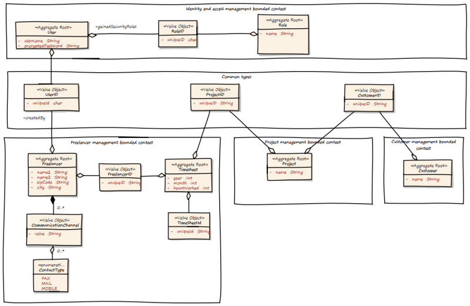
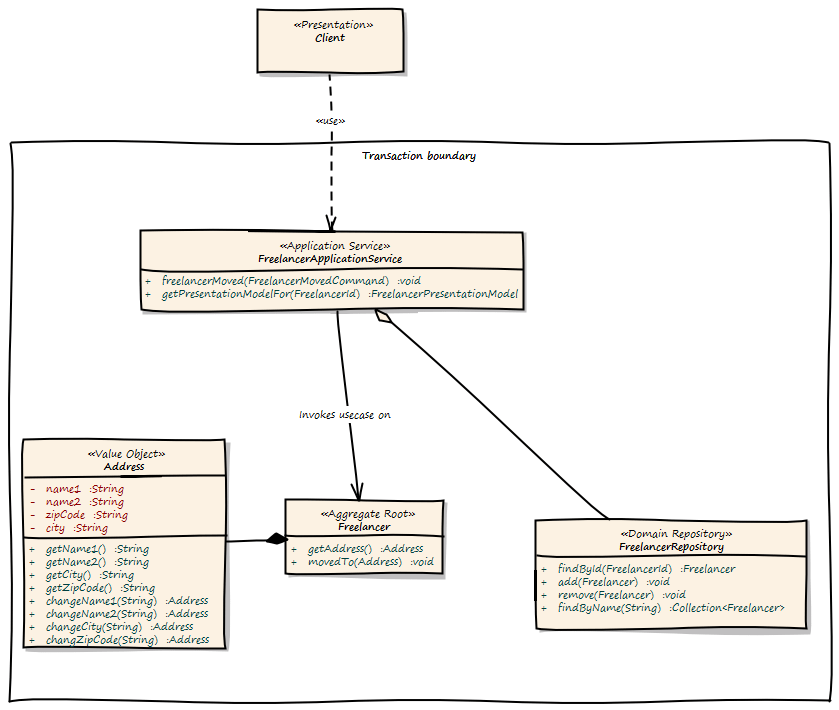

# Domain Driven Design

## Intro
This article aim is to give a brief overview about building blocks and concepts of Domain-Driven-Design focussing on Java Web-Based application.

In the second part of the article we'll cover the concepts of entities, aggregate roots and repositories.

## Domain-Driven Design

Domain-Driven Design is a book by Eric Evans. The book's core focus is on the domain a piece of software is supposed to deal with and how that domain actually connects to the software.

While software design patterns are usually defined through a technical context and are used to describe and capture relationships of classed, DDD is an approach to find a common language between programmers and business and ultimately connect the code to be written to the domain.

One principle behind DDD is to bridge the gap between domain experts and developers by using the same language to create the same language to create the same understanding. Another principle is to reduce complexity by applying object oriented design and design patters to avoid reinventing the wheel.

### Building blocks

The building blocks define common terms that are used to describe model elements and assign certain attributes to them.

### Bounded context

The Bounded Contexts are isolated, they know nothing of each other. They are only glued together by a set of common types, like UserId, ProjectId and CustomerId. In DDD this set of common types is called a “Shared Kernel”. We can also see what is part of the "Core domain" and what is not. If a bounded context is part of the problem we are trying to solve and cannot be replaced by another system, it is part of the "Core domain". If it can be replaced by another system, it is a "Generic Subdomain". The "Identity and access management" context is a "Generic Subdomain", as it could be replaced by an existing IAM solution, such as Active Directory or something else.

Within each Bounded Context there are Aggregates and Value Objects. Aggregates are object hierarchies, but only the root of the hierarchy is accessible from outside of the Aggregate. Aggregates take care of business invariants. Every access to the object tree must go thru the Aggregate and not over one element within. This greatly increases encapsulation.

Aggregates and Entites are things with an unique id in our model. Value Objects are not things, they are values or measures, like a UserId. Value Objects are designed to be immutable, they cannot change their state. Every state changing method returns a new instance of the value Object. This helps us to eliminate unwanted side effects.

#### Value Objects

Represent a concept from the domain that — as the name suggests — is considered a value. In terms of classes that means that individual instances don’t have identity, no lifecycle. A value object needs to be immutable to ensure integrity of the instances as they can be shared amongst different consumers. In the Java language, an instance of String is a good example of these traits, although it’s not a good example for a domain concept as it’s rather generic. A credit card number, an email address are great candidates to be modeled as value objects. Value objects are usually part of other model elements like entities or services.

#### Entities

In comparison to value objects, an entity’s core trait is it’s identity. Two customers named Michael Müller might not constitue the very same instance, so that usually a dedicated property is introduced to capture the identity. Another core trait of entities is that they’re usually subject to a certain lifecycle within the problem domain. They get created, they undergo certain state changes usually driven by domain events and might reach an end state.  Entities usually relate to other entities and contain properties that are value objects or primitives.

**Note: Entities VS Value Objects** It’s not always clear whether to model a domain concept as value object or entity. In fact the concept of an address can — depending on the context — even be modeled as both within the same application. While the address of a store might be a value object might just be part of the domain concept store, it might as well be an entity in the context of modeling a customer as shipping and billing addresses might have to be created, edited, deleted etc.

#### Aggregate roots

Within the set of entities of a system, some usually play a special role in their relationship to others. Consider an order consisting of line items. The order might expose a total which is calculated from the prices of the individual line items. It might only be in a valid state if it is more than a certain minimum total. The root entities of such a construct are usually conceptually elevated to a so called aggregate root and thus create certain implications:
   - The aggregate root is responsible to assert invariants on the entire aggregate. State changes on the aggregate always result in a valid result state or trigger an exception.
   - To fulfil this responsibility, only aggregate roots can be accessed by repositories (see Repositories). State changes involving non-root entities need to be applied by obtaining the aggregate root and triggering it on the root.
   - As an aggregate forms a natural consistency boundaries, references to other aggregates should be implemented in a by-id way.

#### Repositories

Conceptually a repository simulates a collection of aggregate roots and allows accessing subsets or individual items. They’re usually backed by some kind of persistence mechanism but shouldn’t expose it to client code. Repositories refer to entities, not the other way round.

#### Domain services

Domain services implement functionality that cannot uniquely be assigned to an entity or value object or need to orchestrate logic between them and repositories. Business logic should be implemented in entities and value objects as much as possible as it can be tested more easily within them.

## Application Architecture

For every Bounded Context, there should be a separate Deployment Unit(ex: Java WAR file). We designed the Bounded Context to be independent from each other, and this design goal should also be reflected in independent Deployment Units.

Every Deployment Unit contains the following parts:
  - A Domain Layer
  - An Infrastructure Layer
  - Application Layer

### Domain Layer

The Domain Layer contains the real business logic, but does not contain any infrastructure specific code. The infrastructure specific implementation is provided by the Infrastructure Layer. The Domain Model should be designed as described by the CQS(Command-Query-Separation) principle. There can be query methods which do just return data without affecting state, and there are command methods, which affect state but do not return anything.

### Application Layer

The Application Layer takes commands from the User Interface Layer and translates these commands to use case invocations on the domain layer. The Application Layer also provides transaction control for business operations. The application layer is responsible to translate Aggregate data into the client specific presentation model by a Mediator or Data Transformer pattern.

### Infrastructure Layer

The Infrastructure Layer provides the infrastructure dependent parts for all other layers, like a Hibernate or JPA backed implementation. Aggregate data can be stored in an RDMBS like Oracle or MySQL, or it can be stored as XML/JSON or even Google ProtocolBuffers serialized objects in a key-value or document based NoSQL engine. This is up to you, as long the storage provides transaction control and guarantees consistency. Infrastructure can be best described as “Everything around the domain model”, so databases, file system resources or even Web Service consumers if we interact with other systems.

### Client/User Interface Layer

The Client Layer consumes Application Services and invokes business logic on these services. Every invocation is a new transaction.

## EX: A complete Use Case and Persistance

The client sends a command to the ApplicationService. The ApplicationService translates the command to a Domain Model use case invocation. So the FreelancerApplicationService will load the Freelancer Aggregate from the FreelancerRepository and invoke the moveTo() operation on the Freelancer Aggregate. The FreelancerApplicationService forms also the transaction boundary. Every invocation results in a new transaction. Role based security can also be implemented using the FreelancerApplicationService. It is always a good choice to keep transaction control out of the domain model. Transaction control is more a technical issue than a business thing, so it should not be implemented in the domain model.

## References

 - [Domain-Driven Design and Spring](http://static.olivergierke.de/lectures/ddd-and-spring/)

 - [Domain-driven Design Example](https://www.mirkosertic.de/blog/2013/04/domain-driven-design-example/)

## Books

  - 
  - 
  - 

## Code examples
  - [citerus/dddsample-core](https://github.com/citerus/dddsample-core)
  - [ChristophKnabe/spring-ddd-bank](https://github.com/ChristophKnabe/spring-ddd-bank)
  - [VaughnVernon/IDDD_Samples](https://github.com/VaughnVernon/IDDD_Samples)
